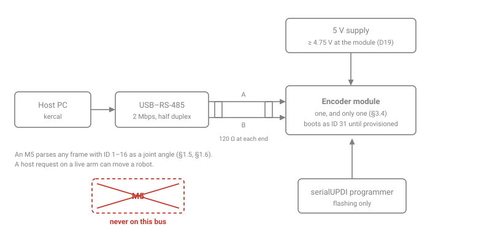
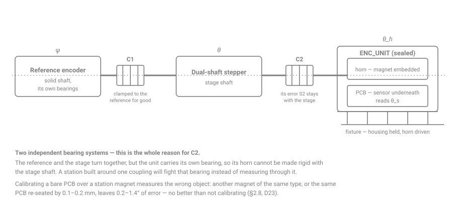
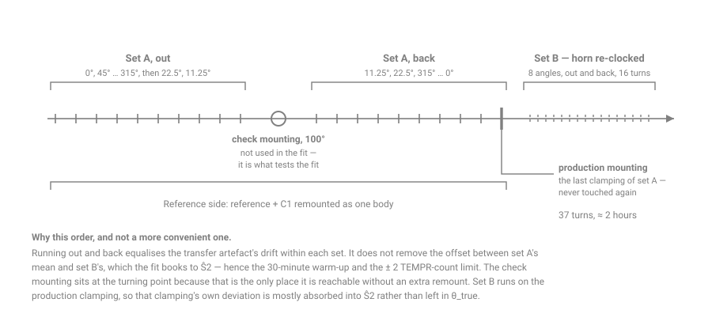

# Building the bench and the calibration station

How to actually build the two pieces of hardware this project needs, in the order you would build
them. The **bench** is an afternoon and a USB adapter. The **calibration station** is a week and a
few hundred euros, and most of that week is spent proving the station before it is allowed to
calibrate anything.

This is the practical companion to the specification, not a replacement for it. Every limit and
criterion here comes from `protocol-spec.md` and is cited; **where the two disagree, the
specification wins** and this document is the thing with the bug.

---

## Part 1 — The bench

### 1.1 What it is for

Flashing, `kercal` diagnostics, the timing measurements of `timing-measurements.md`, and every
open question in §12.2 that does not need a rotating stage. It is also where a module is
provisioned with `SET_ID` if it is not going to be calibrated.

### 1.2 Parts

| | |
|---|---|
| USB–RS-485 adapter | half duplex, must reach **2 Mbps**. Many cheap CH340-based adapters do not; check before buying |
| 5 V supply | **≥ 4.75 V at the module.** `COMMIT_CAL` refuses below 4.5 V (D19), and a loaded USB port can sag through that |
| serialUPDI programmer | Adafruit UPDI Friend or equivalent; see `../README.md`. The HV version is only needed to recover a bricked chip |
| 120 Ω resistors ×2 | bus termination at both ends |
| twisted pair | short. At 2 Mbps a long unterminated stub will show edges that are not there |

### 1.3 Wiring



### 1.4 The one rule

**Never connect this bus to a system with an M5 on it.** An unmodified M5 parses *any* frame whose
header ID is 1–16 as a joint angle (§1.5, §1.6) — a `kercal` request to a module on a live arm is,
to the M5, a joint that has just moved. During zeroing it is worse.

`kercal` enforces what it can: it listens for 200 ms before its first transmission, refuses to start
if anything is talking, and permanently stops transmitting if it ever sees a CMD=1 or CMD=2 frame
(§3.2, C4). Those are backstops, not permission. `kercal listen` transmits nothing and is the only
command that is safe to point at an arm.

During provisioning and calibration, **exactly one module is on the bus** (§3.4). The station reads
`GET_SERNUM` and records it with every result, so the part it fits is by construction the part it
read.

### 1.5 Bring-up, in order

```bash
cd encoder
.venv/bin/pio run -t upload --upload-port /dev/ttyUSB0     # one image for every module
cd tools/kercal
python -m kercal --port /dev/ttyUSB1 listen --seconds 2    # must report "quiet -- a bench bus"
python -m kercal --port /dev/ttyUSB1 scan                  # expect exactly [31]
python -m kercal --port /dev/ttyUSB1 info --id 31
```

Read the `info` output in this order:

1. **`cfg_verify.passed` must be `true`**, and `checks` must list all five. This is the first thing
   any board should be asked, because of the failure it can reveal — see §1.6.
2. `health.flags` on a virgin module should be exactly `CAL_INVALID` plus `WRITE_ELIGIBLE`.
   `CAL_INVALID` is correct here: there is no calibration page yet.
3. `environment.vdd_mv` ≥ 4750. If it is near 4500, fix the supply before going further.
4. `environment.temperature_c` should be plausible. If it reads ≈ 209 °C the host is reading
   `TEMPR` as unsigned; that is a tool bug, not a sensor fault (§2.6).
5. `counters` should be near zero apart from `transactions`.

### 1.6 The failure to look for first

If `cfg_verify` reports everything **except** `SFUSE_clear` — that is, `0x0017` instead of `0x001F` —
stop and read §12.2 O2. It means `STAT.SFUSE` did not clear after `CRCPAR` was rewritten. If it
latches until the sensor is reset rather than clearing at run time, then the configuration lock can
never pass, `SENSOR_CFG_FAIL` sticks, compensation stays suspended, and **every module silently
ships the uncalibrated mapping**. `SFUSE` is also inside `STAT_FAULT`, so every angle read would
fail its status check as well and the persistent-fault rule would pass readings through degraded
after 20 ms. Nothing downstream would notice.

This is one board, one command, and it decides whether the calibration works at all. Do it before
building the station.

---

## Part 2 — The calibration station

### 2.1 What it has to do

Provide `θ_true` — the true angle of the horn — at each of ≥ 128 fit positions and ≥ 128 validation
positions, in both directions, good enough that the module's own error is what is being measured
rather than the station's. **Everything in §7.2 is relative to `θ_true`**: whatever error the
station has in harmonics 1–6 is written into every module, and the acceptance gate cannot see it,
because both passes share it.

With encoder-grade couplings and the commissioning below, `θ_true` is good to about **± 14–18″
(0.004–0.005°)**, of which **± 5–10″** can reach a module (§7.7). That is self-consistent but **not
traceable** — every check compares the chain with itself.

### 2.2 The mechanical chain



The thing to understand before buying anything: **the unit under test is a sealed assembly with its
own bearing** (§2.8). Its horn cannot be made rigid with the stage shaft, so the chain needs a
second coupling. A station built on the assumption of one coupling — or worse, built to calibrate a
bare PCB over a station magnet — measures the wrong object. Another magnet of the same type, or the
same PCB re-seated by 0.1–0.2 mm, leaves 0.2–1.4° of error, which is no better than not calibrating
at all (D23).

### 2.3 Parts, and what actually matters about each

| | Requirement | Why |
|---|---|---|
| **Reference encoder** | **solid shaft with its own bearings**; single-turn; 21–23 bit; Modbus-RTU over RS-485; rated ± 50″ | A hollow-shaft or kit encoder has no bearing of its own and breaks the method for H1 |
| **C1, C2** | encoder-grade **diaphragm or flexure** couplings with a *stated* kinematic transfer error; torsional stiffness ≥ 150 N·m/rad | HEIDENHAIN K 14: ± 6″. A metal bellows: ± 40″. **No helical-beam couplings.** The simulation in §7.7 shows a bellows at C2 triples the low-order error *while still passing the commissioning criteria* — this is a purchasing requirement, not something the station can certify later |
| **Stepper** | dual-shaft | one end to the reference, the other to the unit |
| **Second USB–RS-485** | separate adapter for the reference | do not share the module's 2 Mbps bus |
| **Dial indicator** | — | alignment: radial ≤ 0.05 mm, angular ≤ 0.05° |
| **Fixture** | locates the unit's **housing** repeatably | the housing is held; the horn is driven |
| **Check standard** (recommended) | a second identical reference on its own coupling | read at every calibration; it is what detects drift, slip and coupling faults |
| **Hall probe** | reads to ≈ 200 mT | O6. Not part of the chain, but the first bench item of all |

Full selection record and prices: `station-reference-encoder.md`.

### 2.4 Assembly order

1. Mount the stepper. Everything else is aligned to its shaft.
2. Clamp the reference to C1 **and leave them clamped for good** — C1's transfer error then rotates
   with the reference and is calibrated together with it. This pairing is remounted as one body.
3. Mount reference + C1 on the stage-side hub. Align with the dial indicator: ≤ 0.05 mm radial,
   ≤ 0.05° angular.
4. Mount C2 to the far shaft, and the fixture so that a unit's housing seats repeatably with its
   horn in C2. Align again.
5. Keep the whole thing away from steel and from the stepper's stray field, and **record the
   station's orientation** — Earth's field alone is 0.095° of H1 error at 30 mT, and it belongs to
   the world, not to the module (§2.8).
6. Disable the stepper's hold-current reduction, or wait it out before every reading.

### 2.5 Incoming test of the reference — before it is trusted

Station software only; no extra instruments (§7.7):

| Test | What it tells you |
|---|---|
| Hold a magnet to its housing while reading | any change means it is a **magnetic** encoder — not acceptable at a 72″ tolerance |
| Static noise at 8 angles | the number the stationary-poll criterion is set against |
| Repeatability, 16 positions × 10 turns | whether it returns to the same reading |
| Reversal | its own hysteresis |
| Fine scan, ≥ 1000 microsteps over a few degrees | **sub-divisional error** — and its period tells optical from magnetic. The 24″/15″ guarantee of §7.7 assumes this is ≤ 8″ |
| 30-minute warm-up log | how long before it is stable |
| Register width, latching, maximum baud | so the polling code is right |

### 2.6 Commissioning — once per station build

Repeat this whenever the reference, either coupling, or the fixture is disturbed.

One assembled unit is the **transfer artefact**. Power it ≥ 30 minutes beforehand and keep
`GET_ENV` index 0 within ± 2 `TEMPR` counts (one count is 0.36 K) for the whole run.



Then run the joint fit of §7.7 — `evidence/v3-reference/ref_selfcal.py` is the reference
implementation, and `kercal` carries the same procedure. Two criteria, both provisional until bench
data exist:

- remount **reproducibility** ≤ **8″** rms, over all fitted turns, in H1–H3;
- **check mounting** residual ≤ **12″** in H1–H7.

Read §7.7's second table before trusting a pass: the criteria do not separate good stations from
faulty ones cleanly. What they do guarantee is that no station passing both had a `θ_true` error
above ≈ 24″, or above ≈ 15″ in the harmonics that can reach a module — **provided C2 is an
encoder-grade coupling and the reference's sub-divisional error is ≤ 8″**, neither of which the
criteria can see. That is why §2.3 makes both a purchasing requirement.

### 2.7 In production

`θ_true = ψ − R̂′(ψ) + Ŝ2(ψ − γ_production)`, where `ψ` is the reference reading, `R̂′` the fitted
reference-plus-C1 error, and `γ_production` the clocking of the production mounting.

---

## Part 3 — Calibrating a unit

The computational half is `evidence/v3-reference/station_fit.py`, which `kercal` loads rather than
reimplementing. The physical half is below. Normative detail: §7.2.

**What is calibrated is the fully assembled, sealed unit** — its own horn with its own magnet bonded
and cured, bearing, spacer, PCB, screws at final torque with thread-locker — driven through its horn
with its housing in the fixture. After calibration the spacer and PCB screws are paint-marked; **a
broken mark voids the calibration** (D23). Re-flashing through UPDI needs no disassembly.

### 3.1 The minimums

These are **minimums, not defaults**. The operating characteristic of §7.2 is only established at
these values or above; with 64 + 64 positions the gate already mis-grades parts.

| | |
|---|---|
| fit positions | ≥ 128, uniform |
| validation positions | ≥ 128, interleaved half-way between fit positions, never used in the fit |
| directions | 2 — every position approached clockwise **and** counter-clockwise (D24) |
| readings averaged | ≥ 1024 per position and direction (`SAMPLE_START` e = 10) |

`python -m kercal limits` prints them, and which file they come from.

### 3.2 The run

1. **One unit on the bus.** Power it **≥ 10 minutes**, or until `GET_ENV` index 0 is stable to 1 K —
   the die heats itself by 11–16 K. Record `GET_SERNUM`, ambient and module temperature, VDD and
   `GET_DMAG`.
2. **Noise check.** Re-approach one position 8 times, **always clockwise** — alternating would put
   the hysteresis into the result. If `σ_mean` > `R_MAX`/6 = 0.0033°, stop: the verdict is
   *insufficient data*, the station needs fixing, and **the part gets no grade**.
3. **Fit passes**, clockwise then counter-clockwise. At each position: move, wait until the
   reference polls are stationary, *then* `SAMPLE_START`, then `GET_SAMPLE`. Never overshoot an
   approach, or the hysteresis measurement is void. Discard and repeat any sample with status bit 1
   or 2 set, or with fewer than 90 % of readings passing.
4. **Fit and commit.** The fit is of the **pooled** samples of both directions — the mean curve of
   the hysteresis loop. Stage, `COMMIT_CAL`, read the page back and compare. **Do not release a unit
   until a commit has succeeded and been read back.**
5. **Validation passes**, both directions, on the committed unit, at the interleaved positions —
   measuring what actually ships.
6. **Grade** (§7.2 step 8): **A** ≤ 0.02°, **B** ≤ 0.05°, otherwise **rework**. A rejected unit is
   re-seated and re-run, or scrapped. It is **never** given an identity page and shipped: an
   identity page is 0.6–1.6° of error and nothing on the arm can tell it from a calibrated unit.
7. **Centring gate.** Fitted H2 above 0.2° means the sensor sits ≈ 0.2 mm off the rotation axis, and
   the calibration is fragile to later mechanical shift. Re-seat and re-run rather than ship it.
8. **Record** against `SERNUM` (§9.7). The grade lives in the station database, not on the module.

About **two and a half minutes per unit** at the minimums, plus the warm-up.

---

## Part 4 — When something looks wrong

| Symptom | Where to look |
|---|---|
| `cfg_verify` = `0x0017` | §1.6. Stop everything until it is understood |
| `kercal` refuses to transmit | it heard a frame. Something else is on the bus — find it before overriding anything |
| `scan` finds more than one ID | §3.4 is violated. The part you fit may not be the part you read |
| *insufficient data* at step 2 | the station, not the part. Settling, coupling slip, stray field, or the stepper's hold current |
| grades cluster at B | expected on poor parts; check the fitted H2 first (centring), then the magnet gap (O6) |
| hysteresis above 0.10° | may be the field at the die rather than the mechanics — §12.2 O6 explains why, and why the CW/CCW curve is the indirect test when there is no Hall probe |
| `WRITE_FAIL` on commit | VDD first (`GET_ENV` index 1), then §5.5. The module keeps running its previous calibration and stays unlocked, so retry is safe |
| a unit was reopened | its calibration is void. Re-run it |

---

## Part 5 — What this station cannot tell you

Worth saying plainly, because it is the difference between a number and a claim:

- **It is not traceable.** Every check compares the chain with itself through a module. Closing that
  needs a check standard read at every calibration, plus one comparison of H1–H3 against an
  instrument with its own calibration chart. Until then, `R_MAX` means "relative to this station's
  reference" (D26).
- **A grade is at station conditions.** Temperature, supply and the local stray field are recorded
  because they are part of the result, not context for it.
- **It does not predict accuracy on the arm.** The station removes what is a repeatable function of
  the module's own angle. Stray fields from neighbouring joints, hysteresis, mechanical play and
  temperature remain, and the reviews estimate 0.1–0.4° in use. Only a measurement on an assembled
  arm settles that (§9.6).
